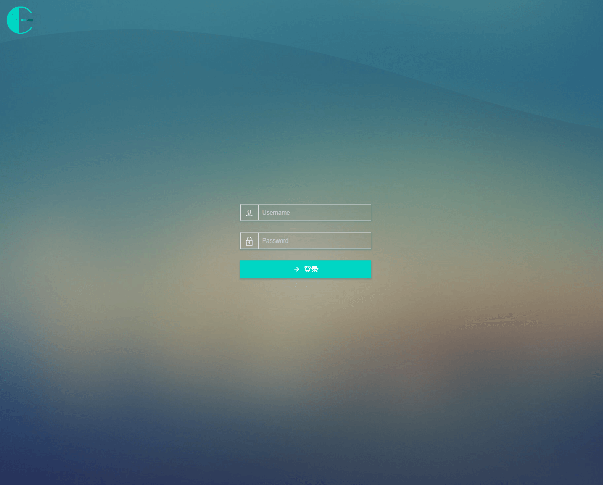
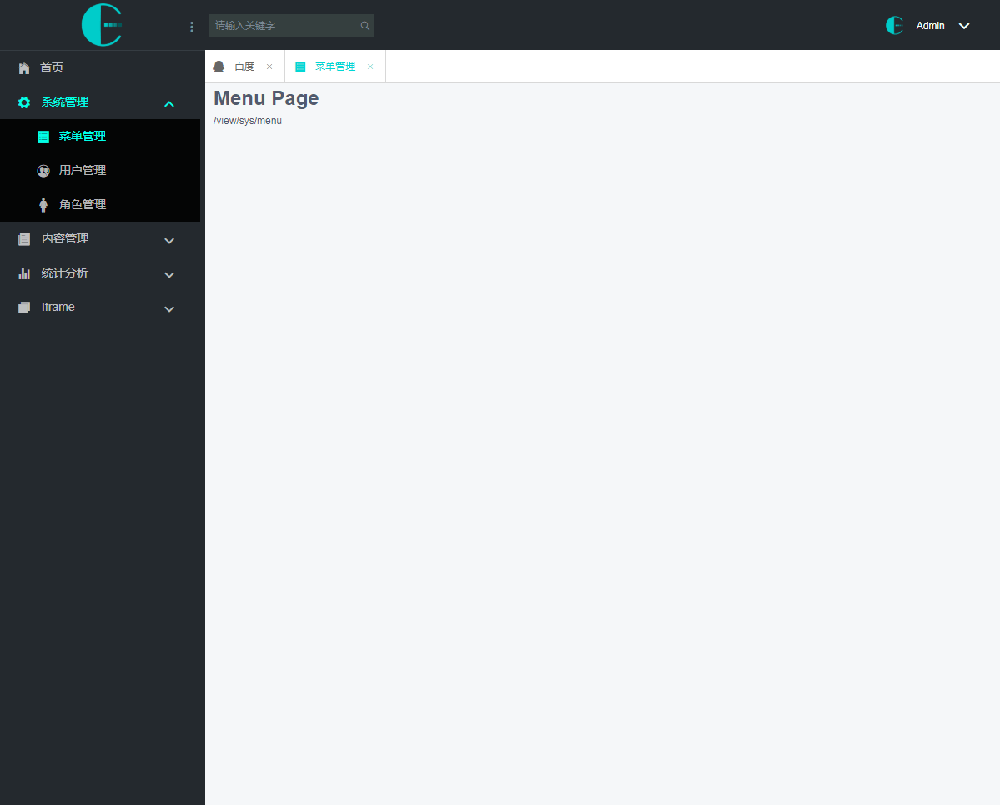
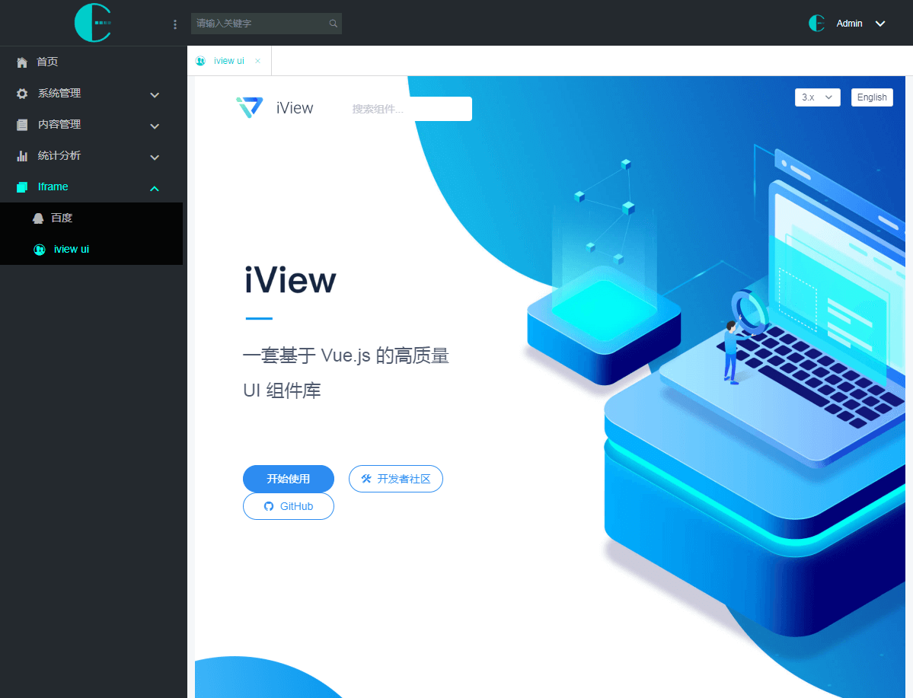

# vue-spa-iview-admin

vue + iview + gupack + webpack 单页面后台管理模板，支持 IFrame 嵌入

### 使用

此实例中用到了 gupack 脚手架工具，当然也可以完全去除

### 通过 gupack 脚手架安装

```javascript
    yarn global add gupack
    // npm install -g gupack

    // 创建项目并从github仓库下载
    gupack create myAdmin --template RodeyManager/vue-iview-admin

    // 进入项目目录
    cd myAdmin
    // 安装项目依赖包
    yarn install
```

### 启动

```javascript
    // dev 环境
    yarn start

    // stg 环境
    yarn run stg

    // prd 环境
    yarn build
    // yarn run prd
```




